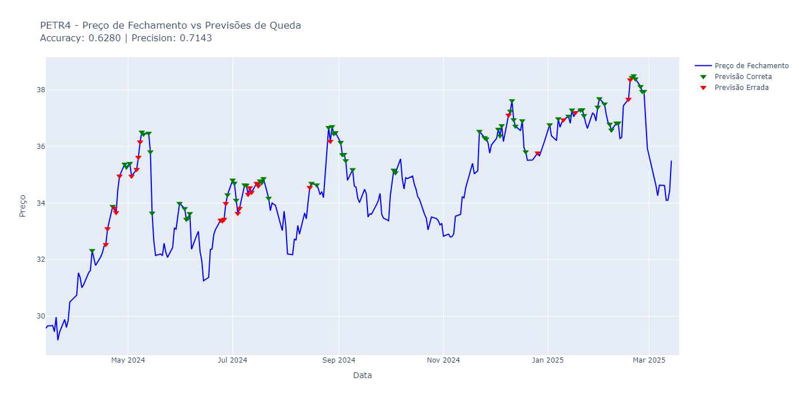
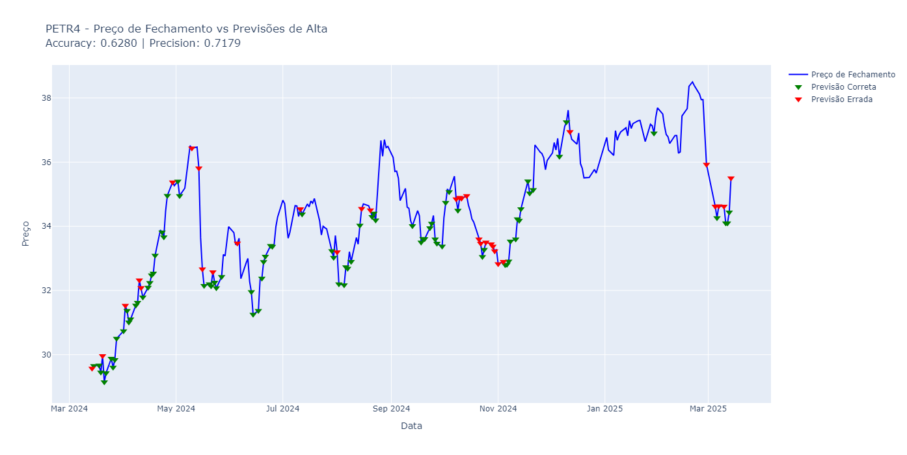
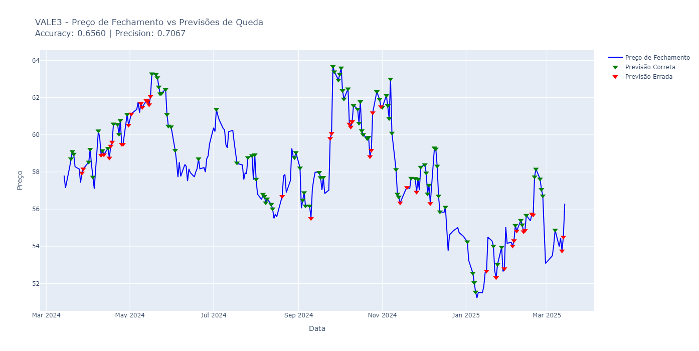
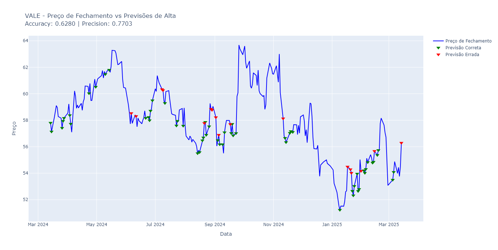

<h1 align="center"> Stock Price Predicition with XGBoost </h1>
Millions of transactions are carried out every day in the Brazilian Financial Market, thousands of people buy and sell stocks every day betting on the price rising or falling. Its a very complex system, and the idea of this project is trying to predict the stock price of some shares in Brazilian Market. 

## Problem Definition 
The main idea is to try to use IA to predict the direction of the market in a few days, like in the interval of 1 or 3 days. 
Futhermore, I want to predict some specific pencetage change, i.e. if the stock moved like 1% or 2% for example.
For this problem I used the shares of PETR4 (Petrobras) and VALE3 (Vale). 

# Getting the Data
The first step was to get daily data for PETR4 and Ibovespa Index that will be used as reference in the data frame, I collected data using yfinance library.  

```python
ticker = "PETR4.SA"
data = yf.download(ticker, period="15y", interval= "1d")
data.to_csv("PETR4.csv")
``` 
In this example the period was set as fifteen years, but its good to take as many data as possible to train the model. 

Obs: yfinance can limit the number of requests that you can use so I needed to get that from MT5 when yfinance blocked me. 

# Processing data and creating Target
I created a funcition process_data to deal with the data frame, it takes 6 arguments: stock (the main stock), secondary_stock (used as reference), shift (an integer), up (True or False), percentage (the percentual change I want to detect) and test periods (an integer indicating the test set in days).
Next step was to create some new freatures for both stocks PETR4 and BVSP and adding the target to train the model. 
My data already had Closing Price, Open, High, Low and Volume, and to improve model performance I added SMA (slow moving average) with 21, 80, 200 and 1000 as periods. Besides that, I added STOCH, ATR and RSI to PETR4 stock. 

```python
df['STOCH'] = TA.STOCH(df)
df['ATR'] = TA.ATR(df)
df['RSI'] = TA.RSI(df)
df['SMA21'] = df['Close'] / TA.SMA(df, 21)
df['SMA80'] = df['Close'] / TA.SMA(df, 80)
df['SMA200'] = df['Close'] / TA.SMA(df, 200)
df['SMA1000'] = df['Close'] / TA.SMA(df, 1000)

df2['STOCH_2'] = TA.STOCH(df2)
df2['SMA21_2'] = df2['Close'] / TA.SMA(df2, 21)
df2['SMA80_2'] = df2['Close'] / TA.SMA(df2, 80)
```

The target takes 3 params in consideration shift, percentage and up (True or False), shift is the interval of days we are predicting, percentage is the variation we want to detect and up indicates if we are predicting the rise or fall of *Closing Price*. Note that shift is used as an interval of days and not as a step, i.e. we are trying to predict if the stock moved up or down by some percentage change in a window of 1 or more days, if the Closing Price is greater (or lower) in any of those days compared with today's Closing Price my target is 1, if not the target is set as 0. 


```python
if up:
    df['Target'] = (
        df['Close'].shift(-shift).rolling(window=shift, min_periods=1).max() > (1 + percentage) * df['Close']
    ).astype(int)
else:
    df['Target'] = (
        df['Close'].shift(-shift).rolling(window=shift, min_periods=1).min() < (1 - percentage) * df['Close']
    ).astype(int)
```
Lastly, the param test period is used to split the data, since the data is a time series we can't use the fucntion train_test_split or cross validation, the data must be in order. The process_data will return df and test if test period was specified, if not the function will return just the df  with both stocks information.

Note: This method using a window has proven to be better than predicting the market for a specific day in advance.

# Test model function
Before creating any model I've created a function to automate the training process, the function test_model takes 5 params: df, test, features, model and proba. 

1. df: is the train dataframe already split.
2. test: validation set to evaluate the model, the group of n days after train set. 
3. features: all the columns we want to use to train the model, excluding the target. 
4. model: its the model itself.
5. proba: is the threshold used to predict the target, default value is 0.5. 

This function is quite simple, it trains the model and uses predict proba to set a value for the prediction, if higher than the threshold the prediction is 1, if lower the predicted class is 0. Lastly, the function returns a df with the target and prediction for every day in the test set. 

# Models
With the automated process it was possible to test various IA models, I tried Ranfom Forest Classifier, XGBoost, LSTM, SVM and 1 dimensional Convolutional Network. 

## Metrics
To evaluate Supervised Learning models I used precision and recall, the main metric I wanted to optimize was precision, altought I noticed that some models had very high precisions, like 1. In these cases the recall was too low, so I changed the metric for optimization to F-beta score that balances recall and precision, I used beta equal to 0.5 and 0.4 depending on the case. Moreover, I evaluate models on their performance on the last 250 days despite the size of the test set (I'll show it was used about 1000 days in test dataset) beause I noticed that there were some models that made lots of good predictions in the first days of the test set and did not make any predictions after 500 days or so. 

```python
combined = test_model(df, test, features, model, proba=0.5)
combined = combined.tail(250)
accuracy = accuracy_score(combined['Target'], combined['Predictions'])
precision = precision_score(combined['Target'], combined['Predictions'])
fbeta = fbeta_score(combined['Target'], combined['Predictions'], beta=0.4)
```

## Best Approach
Firstly, I initially thought that Neural Network methods would give best results, since LSTM is capable of memorize previous data and use this to adjust the weights, and Convolutional Neural Network is a strong method to preprocess data and finding patterns, but these methods have proven to be not so good and had precisions of around 55%. Note that, Neural Network models could be as complex as you want, and I did not tried many variations, so its probable that a differente model could perform much better than this. 

The reason I did not tried many NN models its because Random Forest and XGBoost had very strong results, at the very first test I performed, without optimizing the hiper params of these models, I got accuracies of around *65%* and precisions about *60%* percent. Later, I discarded Random Forest because it takes much more time to train and the results were not better than XGBoost. 

Finally, its importante to say that the best approach was to select *shift= 3*, *test_period= 1400* and *proba= 0.5* (proba is used as the threshold for predict_proba function). 

# XGBoost 
Extreme Gradient Boosting is an implementation of gradient boosted decision trees designed for speed and performance, it is very fast to train a XGBoost model and that's why I choosed it. 

## Feature Engeneering 
As we saw earlier the training data frame has many features, but traning a model with lots of data its not the best approach because there are some features that will not be as important as some others, so at this stage I decided to run many random combinations of features, to do that I trained and test the same model each one with different combinations of features and I selected the best features according to fbeta metric. 

```python
min_features = 4
max_features = len(all_features)
num_random_combinations = 200 # Number of combinations we are running
for shift in [3]:  
    for test_periods in [1000]:
        df, test = process_data(df1, df2, shift=shift, up=False, percentage=0.005, test_periods=test_periods)
        
        for num_features in range(min_features, max_features + 1):
            all_combinations = list(combinations(all_features, num_features))
            random_combinations = random.sample(all_combinations, min(num_random_combinations, len(all_combinations)))
            
            for feature_combination in random_combinations:
                model = XGBClassifier()
                combined = test_model(df, test, list(feature_combination), model, proba=0.5)
                combined = combined.tail(250)
                accuracy = accuracy_score(combined['Target'], combined['Predictions'])
                precision = precision_score(combined['Target'], combined['Predictions'])
                fbeta = fbeta_score(combined['Target'], combined['Predictions'], beta=0.4)
                results.append((shift, False, test_periods, feature_combination, accuracy, precision, fbeta))

# Ordering the resutls
results.sort(key=lambda x: x[4], reverse=True)
```

After runing this I was able to get the best combinations of features based on the choosed metric, this solution has been proved to be a good way to build a good model, but the model's hyperparameters still needed to be optimized. 

## Model optimization with Optuna 
To optimize the hiperparams I used the library Optuna that is usefull to create studies and find the best parameters of a model or a function, the logic of this method is to try different values for a parameter using the functions: 'suggest_float', 'suggest_int' or 'suggest_categorie'. To do that, I need to create a function called objetctive that implements my model, deals with training and testing and return the metrci I want to maximize. 

```python
import optuna

df1, df2 = get_data('VALE3')

# Função objetivo para otimização
def objective(trial):
    
    # Ajustar hiperparâmetros do XGBoost
    n_estimators = trial.suggest_int("n_estimators", 50, 350, step=50)
    max_depth = trial.suggest_int("max_depth", 3, 15)
    learning_rate = trial.suggest_float("learning_rate", 0.001, 0.1, log=True)
    reg_alpha = trial.suggest_float("reg_alpha", 0.0, 1.0, step=0.05)
    reg_lambda = trial.suggest_float("reg_lambda", 0.1, 2.0, step=0.1)
    subsample = trial.suggest_float("subsample", 0.5, 0.9)
    test_periods = trial.suggest_int("test_periods", 900, 1400, step=50)
    proba = trial.suggest_float("proba", 0.4, 0.6)

    # Processamento dos dados
    df, test = process_data(df1, df2, shift=3, up=False, test_periods=test_periods, percentage=0.005)
    
    # Criar o modelo XGBoost
    model = XGBClassifier(
        n_estimators=n_estimators,
        max_depth=max_depth,
        learning_rate=learning_rate,
        reg_alpha=reg_alpha,
        reg_lambda=reg_lambda,
        subsample=subsample,
        random_state=42
    )
    
    # Testar o modelo
    combined = test_model(df, test, features, model, proba=proba)
     # Calcular métricas
    accuracy = accuracy_score(combined['Target'], combined['Predictions'])
    precision = precision_score(combined['Target'], combined['Predictions'])
    fbeta = fbeta_score(combined['Target'], combined['Predictions'], beta= 0.5)

    return fbeta

# Criar estudo Optuna e rodar as otimizações
study = optuna.create_study(direction="maximize")
study.optimize(objective, n_trials=3000)

# Obter os 5 melhores modelos
best_trials = sorted(study.trials, key=lambda t: t.value, reverse=True)[:5]
```
With the best hiperparameters the next and final step is to retrain the model with the parameters finded and plot a graph with price, predictions and metrics. 

## Plot 
I used graph_objs from plotly to plot a dinamic chart with Closing Price and the Predictions, I ploted predictions as a tick on the graph, green if the prediction was righ, and red if it was not right. 

```python
# Criar o gráfico
fig = go.Figure()

# Preço de Fechamento (linha azul)
fig.add_trace(go.Scatter(x=combined.index, y=combined['Close'], mode='lines', name='Preço de Fechamento', line=dict(color='blue')))

# Criar máscaras para previsões corretas e incorretas
queda_correta = (combined['Predictions'] == 1) & (combined['Predictions'] == combined['Target'])
queda_errada = (combined['Predictions'] == 1) & (combined['Predictions'] != combined['Target'])

# Adicionar previsões corretas (verdes)
fig.add_trace(go.Scatter(x=combined.index[queda_correta], 
                         y=combined.loc[queda_correta, 'Close'],  
                         mode='markers', 
                         marker=dict(color='green', size=10, symbol='triangle-down'),
                         name='Previsão Correta'))

# Adicionar previsões erradas (vermelhas)
fig.add_trace(go.Scatter(x=combined.index[queda_errada], 
                         y=combined.loc[queda_errada, 'Close'],  
                         mode='markers', 
                         marker=dict(color='red', size=10, symbol='triangle-down'),
                         name='Previsão Errada'))

# Adicionar título e rótulos
fig.update_layout(title=f'VALE3 - Preço de Fechamento vs Previsões de Queda<br><span style="font-size:16px;">Accuracy: {acc:.4f} | Precision: {precision:.4f}</span>',
                  xaxis_title='Data',
                  yaxis_title='Preço',
                  height=700)  # Aumenta a altura do gráfico para melhor visualização

# Mostrar gráfico interativo
fig.show()
```
# Results 
Using this logic presented here I was able to iterate and try different solutions, looking back now I think the biggest challenge I've faced was to balance precision and recall, because I did want to maximize precision that was my main metric, but I wanted a minimum recall to obtain a good model. 

It's not the purpose of this diretory to show my entire code, because it represents months of work, although I brought some strong results to showcase the power of this approach. 










